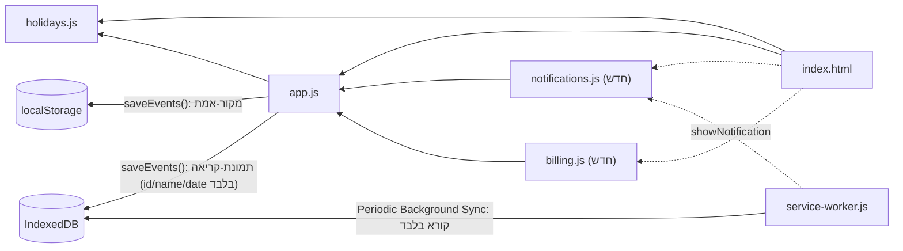
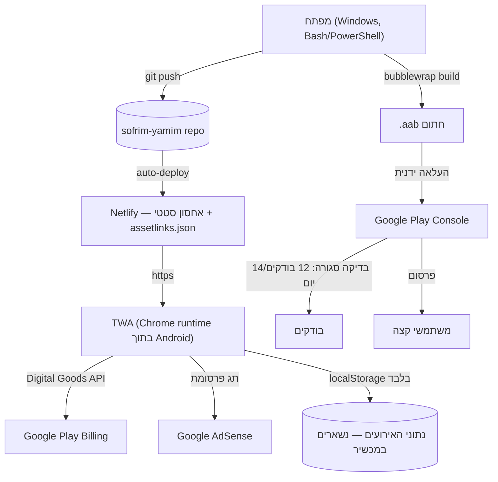

# Architecture Spine — סופרים ימים

## Design Paradigm

**Global-script composition, no framework, no build step.** האפליקציה היא PWA וניל: HTML/CSS/JS טעונים ישירות ע"י הדפדפן, בלי bundler, transpiler או framework. קבצי JS נטענים ברצף קבוע דרך `<script>` tags ב-`index.html` (סדר תלות: `holidays.js` → `app.js` → קבצים חדשים לפי הצורך), ומשתפים namespace גלובלי — אין `import`/`export`, אין מחלקות, פונקציות ומשתנים ברמה העליונה.

זו לא בחירה שרירותית — זו המציאות הקיימת (השלד כבר בנוי ככה, `[ADOPTED]`), והיא גם ההתאמה הנכונה להיקף: אפליקציה קטנה, מפתח יחיד, ללא צורך אמיתי בכלי-build.

## Invariants & Rules

### AD-1 — פרדיגמת קוד ללא build [ADOPTED]

- **Binds:** כל קוד ה-client
- **Prevents:** הכנסה הדרגתית של bundler/framework/module-system שיוצרת קוד היברידי לא-עקבי
- **Rule:** כל קוד JS חדש הוא ES2020+ טעון דרך `<script>` sequential ב-`index.html`. הוספת bundler, framework או TypeScript מחייבת עדכון מפורש של הספיין הזה, לא הכנסה שקטה. **סדר טעינה מחייב:** `holidays.js` → `app.js` → `notifications.js` → `billing.js` — קבצים חדשים תמיד **אחרי** `app.js`, כי הם תלויים בפונקציות הגלובליות שהוא מגדיר. כל קוד ברמה-עליונה (לא בתוך event handler/`DOMContentLoaded`) בקובץ חדש רשאי להפנות רק לגלובלים שהוגדרו בקבצים שנטענו **לפניו**.

### AD-2 — מקור-אמת יחיד לנתונים, עם תמונת-קריאה נגזרת ל-Service Worker

- **Binds:** כל נתוני האירועים
- **Prevents:** מיקומי אחסון כפולים/סותרים; ניסיון (שבור מיסודו) לקרוא ל-`localStorage` מתוך Service Worker
- **Rule:** כל נתוני האירועים חיים במפתח `localStorage` יחיד (`STORAGE_KEY` ב-`app.js`, כרגע `"sofrim-yamim.events.v1"`). קריאה/כתיבה בעמוד **רק** דרך `loadEvents()`/`saveEvents()` הקיימות — שום קוד אחר לא קורא ל-`localStorage` ישירות על מפתח זה. **חריג מפורש והכרחי:** ל-Service Worker (ב-`service-worker.js`) **אין גישה ל-`localStorage`** — זו עובדה בפרוטוקול, לא הגבלה טכנית שאפשר לעקוף. לכן `saveEvents()` גם כותבת תמיד תמונת-קריאה מינימלית (`id`, `name`, `date` בלבד — **לא** האובייקט המלא) ל-**IndexedDB**, ייעודית לצריכת ה-Periodic Background Sync handler ב-AD-6. תמונת ה-IndexedDB היא **read-only מבחינת ה-SW** (אף פעם לא נכתבת שם) ו**לעולם לא נקראת ע"י קוד העמוד** — `localStorage` נשאר מקור-האמת היחיד לכל דבר שקורה בתוך העמוד עצמו.

### AD-3 — ללא שרת, נתונים לא עוזבים את המכשיר

- **Binds:** כל התכונות, כולל החדשות (התראות, מונטיזציה)
- **Prevents:** הכנסה שקטה של שרת/backend "כדי לפתור בעיה" (למשל אמינות-התראות) שסותרת את עמדת הפרטיות המוצהרת ב-PRD ובטופס Data Safety
- **Rule:** קריאות רשת מותרות רק לשלושה יעדים: (1) טעינת תג-פרסומת AdSense, (2) Google Play Billing דרך Digital Goods API (מטופל ע"י Google, לא שרת שלנו), (3) בקשות ה-fetch הרגילות של ה-Service Worker לנכסים הסטטיים של האפליקציה עצמה. שום נתון-אירוע או מזהה-משתמש לא נשלח לשום שרת בבעלותנו.

### AD-4 — רכישות דרך Digital Goods API בלבד

- **Binds:** FR-9
- **Prevents:** ניסיון להטמיע Google Play Billing native (Kotlin) או שרת-תשלומים עצמאי
- **Rule:** רכישת "הסרת פרסומות" עוברת אך ורק דרך `Payment Request API` + `getDigitalGoodsService('https://play.google.com/billing')` (**אומת ישירות מול developer.chrome.com**: API יציב ו-shipped במלואו, **לא** מאחורי origin trial, נתמך מ-Chrome 101+ עבור TWA — לא מיושן, לא מוחלף). מצב-הרכישה נשמר במפתח `localStorage` **ייעודי ונפרד** (`sofrim-yamim.purchase.v1`, צורה: `{adsRemoved: boolean, verifiedAt: ISO-timestamp}`) אחרי `listPurchases()` — **לא** באותו מפתח כמו נתוני האירועים (AD-2). נקרא **רק** דרך helper יחיד, `hasRemovedAds()`, שחשוף מ-`billing.js` — כל קוד שצריך להחליט אם להציג את ה-Ad Banner (כולל `app.js`) קורא ל-helper הזה, לעולם לא למפתח ה-`localStorage` ישירות. מאומת מחדש בכל עליית אפליקציה קרה — לא נסמך על cache בלבד, כדי לתמוך בשחזור רכישה אחרי התקנה מחדש (PRD FR-9).

### AD-5 — פרסומות הן web-embedded, לא SDK native

- **Binds:** FR-8
- **Prevents:** ניסיון להטמיע את ה-AdMob SDK הנייטיבי של אנדרואיד בתוך ה-wrapper — **אומת שזה לא עובד באופן אמין בתוך TWA טהור** (Chrome שולט ברינדור במסך-מלא, אין דרך רשמית לצייר View native מעליו — עדיין issue פתוח: `github.com/GoogleChrome/android-browser-helper#535`, נכון ל-2025-2026)
- **Rule:** הפרסומת מוצגת כתג-פרסומת web רגיל (Google AdSense) המוטמע ישירות ב-HTML של `index.html` בתוך רכיב ה-Ad Banner — בדיוק כמו שהיה מוצג בכל אתר. **סיכון ידוע ומאושר ע"י המשתמש:** מדיניות AdMob/AdSense לגבי הצגה בתוך wrapper/WebView אינה חד-משמעית; זהו סיכון עסקי מודע, לא פער-ידע. אם גוגל תאכוף נגד זה בעתיד, AD-5 זקוקה לבדיקה מחדש (ר' Deferred).

### AD-6 — התראות: best-effort בלבד, ללא שרת-push

- **Binds:** FR-6, FR-7
- **Prevents:** הוספה שקטה של שרת-push "כדי לתקן אמינות" באמצע פיתוח, שסותרת AD-3
- **Rule:** תזכורות מופעלות דרך **Periodic Background Sync** (מעיר את ה-Service Worker, שקורא את תמונת-הקריאה ב-IndexedDB — ר' AD-2 — **לא** `localStorage` שאינו נגיש לו כלל — ומחליט אם לקרוא ל-`registration.showNotification()`) + בדיקה-בפתיחת-אפליקציה (דרך `app.js`, נגד `localStorage` הרגיל) כ-fallback. **מגבלה ידועה ומתועדת:** Periodic Background Sync דורש PWA מותקן (מתקיים) אבל גם ציון-מעורבות (engagement score) גבוה מהדפדפן — משתמשים בעלי מעורבות נמוכה עלולים לא לקבל את ההרשאה כלל. **היעד "95%+ מסירה" מה-PRD (§8) לא בר-השגה באופן מובטח בארכיטקטורה client-only הזו** — זהו פשרון-מוצא מכוון, לא כשל. שדרוג לפתרון מבוסס-שרת הוא החלטת ארכיטקטורה נפרדת ומפורשת ל-v2 (ר' Deferred), לא תיקון הדרגתי.

### AD-7 — משטחים משניים הם דיאלוגים בלבד

- **Binds:** ארכיטקטורת המידע (EXPERIENCE.md)
- **Prevents:** משטח חדש שהופך בשקט לעמוד-נתיב/ניווט-רב-עמודים
- **Rule:** כל משטח משני (הוספה/עריכה, חגים, הגדרות) הוא אלמנט `<dialog>` נייטיבי שנפתח מהמסך הראשי. אין client-side router, אין ניווט בין "עמודים" — עומק מודאל אחד בלבד (עקבי עם EXPERIENCE.md.Foundation).

### AD-8 — גרסאות Cache מפורשות [ADOPTED]

- **Binds:** התנהגות אופליין/PWA (`service-worker.js`)
- **Prevents:** באגי cache-מיושן בין גרסאות שחרור
- **Rule:** `CACHE_NAME` מוגדל בכל שינוי לנכסים ה-cached; ה-`activate` handler מנקה caches שלא תואמים לגרסה הנוכחית (כבר ממומש — מאושרר כאן כאילוץ שיש לשמר, לא לשנות בטעות).

### AD-9 — בעלות בלעדית על אלמנט ה-Ad Banner

- **Binds:** FR-8, FR-9, DESIGN.md.Components (Ad Banner)
- **Prevents:** שני קטעי קוד (רינדור-פרסומת ולוגיקת-רכישה) "יורשים" אותו DOM element בדרכים סותרות — אחד יוצר אותו מחדש, השני מצפה שהוא כבר קיים
- **Rule:** אלמנט ה-Ad Banner הוא **static** ב-`index.html` (`id="ad-banner"`), לא נוצר דינמית ע"י `app.js`. `billing.js` הוא הבעלים הבלעדי של ההחלטה **האם** להציג אותו (מחליף `display:none`/`display:block` על סמך `hasRemovedAds()` — ר' AD-4) — לעולם לא מוחק/יוצר מחדש את האלמנט. תג ה-AdSense עצמו (ר' AD-5) חי בתוך אותו container קבוע.

**תרשים תלויות (מי תלוי במי):**



חוק תלות: `holidays.js` הוא data-only, לא תלוי באף קובץ אחר. `app.js` הוא הליבה — תלוי ב-`holidays.js` בלבד, ובעל הבעלות היחיד על הכתיבה לשני מאגרי האחסון (`localStorage` דרך `saveEvents()`, ומראה ל-`IndexedDB` כתוצר-לוואי של אותה קריאה). קבצים חדשים (`notifications.js`, `billing.js`) תלויים ב-`app.js` (לקריאת אירועים דרך `loadEvents`), **לא להיפך** — `app.js` לא תלוי בהם ישירות; הם נטענים אחריו (ר' AD-1 סדר טעינה) ונרשמים כ-event listeners. `service-worker.js` תלוי רק ב-`IndexedDB` (קריאה בלבד) — **אין לו נתיב** ל-`localStorage` או ל-`app.js` (עובדת פרוטוקול, ר' AD-2).

## Consistency Conventions

| תחום | קונבנציה |
| --- | --- |
| שמות (ישויות, קבצים, אירועים) | אובייקט-אירוע: `{id, name, date, emoji}` (camelCase). קבצים: kebab-case (`service-worker.js`). משתני CSS: `--kebab-case` custom properties. |
| נתונים ופורמטים | תאריכים: מחרוזת ISO 8601 (`YYYY-MM-DD`) בלבד ב-storage — לעולם לא אובייקט `Date` נשמר ישירות. מזהים: `crypto.randomUUID()`. |
| מוטציית מצב | כל שינוי לנתוני אירועים עובר דרך `loadEvents()`/`saveEvents()` בלבד (AD-2). כשלי רשת (פרסומת/רכישה/התראה) נכשלים בשקט למצב מושבת — **לעולם לא חוסמים את פונקציונליות הספירה הבסיסית**, עקבי עם הבטחת-הפשטות של המוצר. |
| שפה/כיווניות | כל טקסט חדש בעברית, `dir="rtl"` בכל אלמנט חדש — עקבי עם FR-10. |

## Stack

| רכיב | גרסה |
| --- | --- |
| HTML5 / CSS3 / JavaScript (ES2020+) | תמיכת דפדפן נייטיבית, ללא build |
| Node.js (סביבת פיתוח, ל-Bubblewrap בלבד) | 14.15.0+ נדרש; **24.16.0 כבר מותקן** במחשב הפיתוח |
| `@bubblewrap/cli` | **1.25.0** (npm, אומת 2026-08) |
| Digital Goods API + Payment Request API | Chrome 101+ (native דפדפן, ללא חבילה) |
| Periodic Background Sync API | Chromium/Android בלבד (native דפדפן) |
| Google AdSense | תג web, ללא גרסת SDK לנעוץ |
| Netlify | אחסון סטטי (לפי `netlify.toml` קיים) |
| Python + Pillow | 3.11 / 12.3.0 — כלי build לאייקונים בלבד (`gen_icons.py`), לא runtime |

## Structural Seed

```text
sofrim-yamim/
  index.html              # נקודת כניסה יחידה, כל ה-<script> tags כאן
  style.css                # עיצוב גלובלי (טוקנים לפי DESIGN.md)
  app.js                   # ליבה: ניהול אירועים, רינדור, loadEvents/saveEvents
  holidays.js              # data-only: מערך חגים מוכנים-מראש
  notifications.js         # [חדש] בקשת הרשאה + לוגיקת fallback בפתיחת-אפליקציה (FR-6/FR-7); הבדיקה בפועל בזמן sync רצה ב-service-worker.js
  billing.js                # [חדש] Digital Goods API + Payment Request API + hasRemovedAds() helper (FR-9, AD-4)
  manifest.json             # PWA manifest
  service-worker.js         # Cache (AD-8) + Periodic Background Sync handler — קורא IndexedDB בלבד, ר' AD-2/AD-6
  icons/                    # אייקוני PWA (נוצרו ע"י gen_icons.py)
  gen_icons.py               # כלי build (Pillow) — לא נטען ב-runtime
  favicon.png
  privacy-policy.html        # דף פרטיות עצמאי (סטטי)
  netlify.toml                # תצורת אחסון
  .well-known/
    assetlinks.json           # [חדש] אימות דיגיטלי TWA↔Android package (נדרש ל-Bubblewrap)
  twa-manifest.json            # [חדש, נוצר ע"י bubblewrap init] תצורת עטיפת ה-TWA
```

**תרשים פריסה (Deployment):**



**סביבת הפעלה:** אין סביבות staging/production נפרדות ב-v1 — Netlify branch יחיד (main) משרת גם את ה-PWA החי וגם את מקור-האמת ל-TWA. עדכון קוד = `git push` → Netlify מפרסם אוטומטית → משתמשי TWA מקבלים את הגרסה החדשה בפעם הבאה שהם פותחים את האפליקציה (ה-Service Worker מנהל את מחזור העדכון, AD-8). **מפתח החתימה (keystore) שנוצר ע"י Bubblewrap הוא היחיד שמחוץ ל-git** (ר' `.gitignore` קיים) — גיבוי שלו הוא באחריות המשתמש (מתועד ב-README, לא ניתן לשחזור אם הולך לאיבוד).

## Capability → Architecture Map

| דרישה (PRD) | חי ב- | נשלט ע"י |
| --- | --- | --- |
| FR-1, FR-2, FR-3 (ניהול אירועים) | `app.js` | AD-1, AD-2 |
| FR-4, FR-5 (חגים מוכנים-מראש) | `holidays.js` + `app.js` | AD-1, AD-2 |
| FR-6, FR-7 (התראות) | `notifications.js` (חדש) + `service-worker.js` | AD-2, AD-3, AD-6 |
| FR-8 (באנר פרסומת) | `index.html` (תג AdSense מוטמע) | AD-5, AD-9 |
| FR-9 (הסרת פרסומות) | `billing.js` (חדש) | AD-3, AD-4, AD-9 |
| FR-10 (RTL) | `style.css`, `index.html` | Consistency Conventions |
| FR-11 (אופליין/PWA) | `service-worker.js`, `manifest.json` | AD-8 |

## Deferred

- **פתרון-שרת להתראות אמינות יותר** — נדחה במכוון (AD-6); רלוונטי רק אם נתוני-שימוש אחרי השקה מראים ששיעור המסירה בפועל נמוך מדי. החלטה נפרדת ומפורשת, לא תיקון שקט.
- **סיכון TOS של AdSense בתוך TWA** — לא "פתור", מנוטר. אם גוגל תאכוף נגד המודל, AD-5 דורשת עיון מחדש (רשת פרסום web חלופית, או מעבר ל-wrapper native היברידי).
- **תמיכת iOS (Capacitor)** — נדחה כליל, לא בטווח הספיין הזה (PRD §5, שאלה פתוחה #5).
- **סנכרון ענן / חשבונות משתמש** — נדחה במפורש (PRD Non-Goals) — AD-3 נשארת בתוקף כל עוד זה כך.
- **חישוב אוטומטי של תאריכי חג עבריים** (במקום `holidays.js` מעודכן ידנית) — נדחה, מועמד ל-v2 (PRD §14 שאלה 6).
- **i18n רב-לשוני** — נדחה כליל (PRD Non-Goals).
